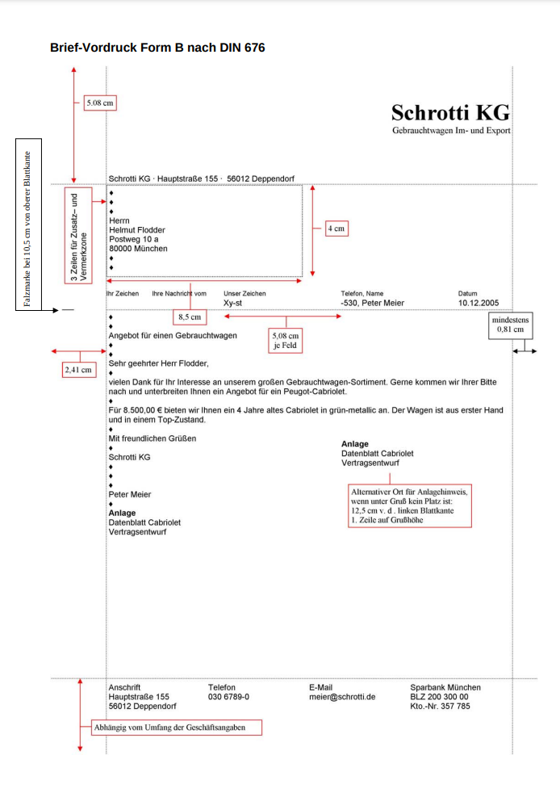

layout: true
  

  <table>
    <tr>
      <td style="text-align:right">Sächsische Landesbibliothek – Staats- und Universitätsbibliothek</td>
      <td>11.12.2023</td>
      <td style="text-align:right"><a href="https://www.slub-dresden.de/">www.slub-dresden.de</a></td>
    </tr>
    <tr>
      <td style="text-align:right">Referat 4.3</td>
      <td />
    </tr>
  </table>

  <table>
    <tr>
      <td style="text-align:left"><b>Kay-Michael Würzner</b></td>
    </tr>
    <tr>
      <td style="text-align:left">Referat 4.3</td>
    </tr>
    <tr>
      <td style="font-size:8pt"><b>11.12.2023</b></td>
    </tr>
    <tr>
      <td style="font-size:8pt">LaTeX@SLUB</td>
    </tr>
  </table>

---

class: title-slide
count: false

# LaTeX-Bausteine
## Geschäftsbriefe setzen mit DINBrief

---

# Überblick

- LaTeX@SLUB
- DIN 676
- LaTeX-Paket [`dinbrief`](https://tex.zih.tu-dresden.de/)
- Hands-on in [`ShareLatex`](https://tex.zih.tu-dresden.de/)

---

class: part-slide
count: false

# LaTeX@SLUB

---

# LaTeX@SLUB

.cols[
.fifty[
- LaTeX als Teil des bibliothekspädagogischen Angebots
- **Ziele:**
  + LaTeX als Textsatzprogramm etablieren
  + *Computer literacy* stärken
  + wissenschaftliche Professionalität stützen
]
.fifty[

]
]

---

class: part-slide
count: false

# DIN 676

---

# DIN 676

.cols[
.fifty[
- inzwischen zurückgezogene Norm mit Gestaltungsregeln für Geschäftsbriefe
  + Positionierung für Adressen (e.g. für Fensterumschläge)
  + Faltmarken und Abstände
  + einheitliche Bezeichner für Elemente
]
.fifty[

]
]

---

count: false

# DIN 676

.cols[
.fifty[
- inzwischen zurückgezogene Norm mit Gestaltungsregeln für Geschäftsbriefe
  + Positionierung für Adressen (e.g. für Fensterumschläge)
  + Faltmarken und Abstände
  + einheitliche Bezeichner für Elemente
- in DIN 5008 aufgegangen
]
.fifty[

]
]

---

count: false

# DIN 676

.cols[
.fifty[
- inzwischen zurückgezogene Norm mit Gestaltungsregeln für Geschäftsbriefe
  + Positionierung für Adressen (e.g. für Fensterumschläge)
  + Faltmarken und Abstände
  + einheitliche Bezeichner für Elemente
- in DIN 5008 aufgegangen
]
.fifty[

]
]

---

class: part-slide
count: false

# LaTeX-Paket dinbrief

---

# LaTeX-Paket dinbrief

- alle Briefelemente als vordefinierte Makros, e.g.
  + Inhaltsangabe: `subject`
  + Anlagen: `encl`
  + Antwortadresse: `backaddress`
- abgeleitet von `letter`-Klasse
  + angepasst auf DIN 676
- inkl. Serienbrieffunktionalität
- Alternativen, e.g.
  + [g-brief](https://ctan.org/pkg/g-brief?lang=de)
  + [scrlttr2](https://ctan.org/pkg/scrlttr2?lang=de) (Koma-basiert)
- ähnliche Konzepte, unterschiedliche Makrobenamung, e.g.
  + `subject` → `Betreff`

---

class: part-slide
count: false

# Demo

---

class: part-slide

# Vielen Dank für Ihre Aufmerksamkeit!

<a href="https://wrznr.github.io/latex-modules-dinbrief/#1">wrznr.github.io/latex-modules-dinbrief</a>

