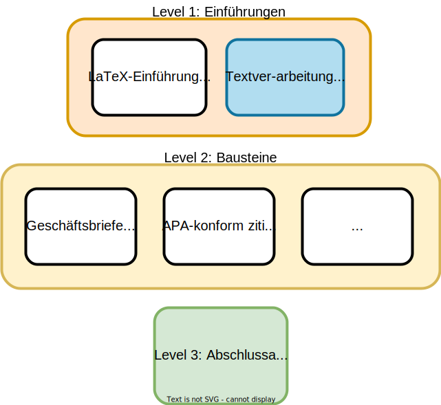

layout: true

  <table>
    <tr>
      <td style="text-align:right">Saxon State Library – State and University Library</td>
      <td>13.06.2024</td>
      <td style="text-align:right"><a href="https://www.slub-dresden.de/">www.slub-dresden.de</a></td>
    </tr>
    <tr>
      <td style="text-align:right">Research-related services</td>
      <td />
    </tr>
  </table>

  <table>
    <tr>
      <td style="text-align:left"><b>Kay-Michael Würzner</b></td>
    </tr>
    <tr>
      <td style="text-align:left">Research-related services</td>
    </tr>
    <tr>
      <td style="font-size:8pt"><b>13.06.2024</b></td>
    </tr>
    <tr>
      <td style="font-size:8pt">LaTeX@SLUB</td>
    </tr>
  </table>

---

class: title-slide
count: false

# LaTeX Modules
## Setting Business Letters with DINBrief

---

# Overview

- LaTeX@SLUB
- DIN 676
- LaTeX package [`dinbrief`](https://tex.zih.tu-dresden.de/)
- Hands-on in ShareLatex

---

class: part-slide
count: false

# LaTeX@SLUB

---

# LaTeX@SLUB

.cols[
.fifty[
- LaTeX as part of the library's educational offerings
- **Goals:**
  + Establish LaTeX as a typesetting program
  + Strengthen *computer literacy*
  + Support scientific professionalism
]
.fifty[

]
]

---

class: part-slide
count: false

# DIN 676

---

# DIN 676

- Standard for business letters in Germany
- Defines layout, sections, and formatting
- Ensures uniformity and professionalism

---

class: part-slide
count: false

# LaTeX Package dinbrief

---

# LaTeX Package dinbrief

- Provides predefined macros for all elements of business letters, e.g.
  + Sender: `address`
  + Date: `date`
  + Subject: `subject`
- Simplifies the creation of DIN-compliant letters
- Example usage: 
  + `\begin{letter}{Recipient}`
  + `\opening{Dear Sir or Madam,}`
  + `\closing{Sincerely,}`
  + `\end{letter}`

---

class: part-slide
count: false

# Demo

---

class: part-slide

# Thank you for your attention!

<a href="https://wrznr.github.io/latex-modules-dinbrief/#1">wrznr.github.io/latex-modules-dinbrief</a>

